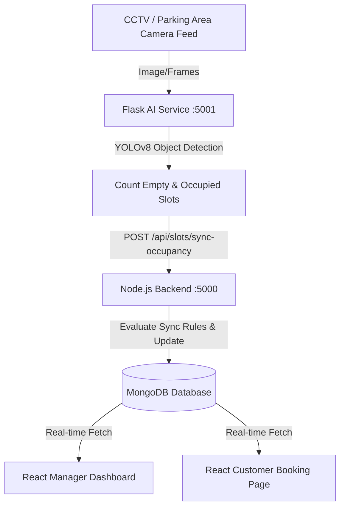

# 🚗 ParkWise AI — Intelligent Parking Operations & Occupancy Monitoring

ParkWise AI is a complete, state-of-the-art parking management and monitoring ecosystem powered by **YOLOv8 Computer Vision**, a **Node.js/Express/Mongoose Backend**, and a **React Frontend (TanStack Start)**. It automates real-time parking space detection, matches occupancy status changes to live bookings, handles smart reservation flows, and displays dynamic dashboards for both Parking Managers and Customers.

---

## 🛠️ Technology Stack

| Layer | Technology | Details |
| :--- | :--- | :--- |
| **Frontend** | React, TanStack Start, TanStack Router, Lucide Icons, Vanilla CSS | Premium dark-themed, glassmorphic client interface. |
| **Backend** | Node.js, Express, MongoDB Atlas, Mongoose, JWT | Secure REST API server handling authentication, slots, vehicles, and bookings. |
| **AI Service** | Flask, PyTorch, YOLOv8 (Ultralytics), OpenCV, Python | Lightweight computer vision service detecting slot availability from camera feeds. |

---

## 📐 System Architecture & Workflow

The platform maintains live synchronization between visual camera feeds and databases through the following workflow:



1. **Detection**: The CCTV camera captures the layout. The image is passed to the Flask AI Service.
2. **Analysis**: YOLOv8 detects spaces labeled `space-empty` and `space-occupied`.
3. **Syncing**: Flask posts results to the backend which triggers business rules to update database statuses and active bookings.
4. **Presentation**: The React client fetches live availability stats dynamically.

---

## 🗂️ Project Structure

```text
ParkWise/
├── ai-service/             # Flask Application & YOLO Detection models
│   ├── app.py              # Flask server boots on port 5001
│   ├── best.pt             # Trained YOLOv8 weight file
│   └── requirements.txt    # Python dependencies
│
├── backend/                # Express & Node.js Application
│   ├── config/             # DB setup (db.js) & Environment loaders
│   ├── controllers/        # REST Route controllers
│   ├── models/             # Mongoose schemas (User, Vehicle, Slot, Booking, Analytics)
│   ├── routes/             # API Router definitions
│   ├── services/           # Core business logic handlers (Slot synchronization service)
│   ├── package.json        # Node dependencies
│   └── server.js           # Express server boots on port 5000
│
└── frontend/               # React Client SPA
    ├── src/
    │   ├── components/     # UI, landing, and dashboard layouts
    │   ├── routes/         # TanStack routes (booking page, vehicle registration, auth)
    │   ├── lib/            # Shared state utilities (session store)
    │   └── styles.css      # Core CSS tokens & custom styling
    ├── package.json        # Frontend scripts and dependencies
    └── vite.config.ts      # Vite dev bundler config
```

---

## ⚡ Core Features

### 1. YOLOv8 Parking Occupancy Detection
- A customized Flask endpoint `POST /analyze` consumes parking area photographs or camera snapshots.
- Executes classification & bounding box validation.
- Returns JSON tracking precise slot occupancy tallies:
  ```json
  {
    "empty": 26,
    "occupied": 79,
    "total": 105
  }
  ```

### 2. Intelligent Slot Status Syncing & Booking Rules
When the AI detects occupancy shifts, it maps visual changes to slot structures in MongoDB under these transition states:
- **Rule 1 (Occupancy)**: If AI detects a slot as *occupied* and status is `empty` $\rightarrow$ Updated to `occupied`.
- **Rule 2 (Arrival Check-in)**: If AI detects a slot as *occupied* and status is `reserved` $\rightarrow$ Updated to `occupied` (Vehicle has safely arrived).
- **Rule 3 (Departure Auto-Complete)**: If AI detects a slot as *empty* and status is `occupied` $\rightarrow$ Updated to `empty` and the associated active booking is automatically marked as `completed`.
- **Rule 4 (Reservation Shield)**: If AI detects a slot as *empty* and status is `reserved` $\rightarrow$ Retains `reserved` (Preserves slot for booking arrivals).

### 3. Customer Booking Experience
- **Live Counters**: Displays absolute live counts of available slots in real-time.
- **Reservation Guard**: Automatically blocks further bookings if maximum lot capacities are breached.
- **Vehicle Profiles**: Proprietors can create, edit, and delete multiple registered vehicles.

### 4. Manager Dashboard
- Provides overview cards for Total, Available, and Occupied slots updated dynamically.
- Includes a live CCTV mock frame rendering visual diagnostics.
- Houses layout settings for facility features, zones, and slot-type allocations.

---

## 🗄️ Database Schemas (MongoDB)

### User
```javascript
{
  name: { type: String, required: true },
  email: { type: String, required: true, unique: true },
  phone: { type: String, required: true },
  address: { type: String, required: true },
  postalCode: { type: String, required: true },
  role: { type: String, enum: ["vehicle_owner", "parking_manager"], required: true }
}
```

### Vehicle
```javascript
{
  userId: { type: ObjectId, ref: 'User', required: true },
  vehicleNumber: { type: String, required: true, unique: true },
  vehicleType: { type: String, enum: ["Car", "Bike", "SUV", "Truck", "Electric Vehicle"], required: true },
  vehicleColor: { type: String, required: true },
  vehicleModel: { type: String, required: true }
}
```

### ParkingLot
```javascript
{
  parkingName: { type: String, required: true },
  parkingAddress: { type: String, required: true },
  city: { type: String, required: true },
  postalCode: { type: String, required: true },
  contactNumber: { type: String, required: true },
  email: { type: String, required: true },
  parkingType: { type: String, enum: ["Public Parking", "Mall Parking", "Office Parking", "Airport Parking", "Residential Parking"], required: true },
  totalCapacity: { type: Number, required: true },
  bikeSlots: { type: Number, required: true },
  carSlots: { type: Number, required: true },
  suvSlots: { type: Number, required: true },
  truckSlots: { type: Number, required: true },
  facilities: { type: [String] },
  createdBy: { type: ObjectId, ref: 'User', required: true }
}
```

### ParkingSlot
```javascript
{
  parkingLotId: { type: ObjectId, ref: 'ParkingLot', required: true },
  slotId: { type: String, required: true },
  zone: { type: String, required: true },
  slotType: { type: String, enum: ["Car", "Bike", "SUV", "Truck"], required: true },
  status: { type: String, enum: ["empty", "reserved", "occupied", "maintenance"], default: "empty", required: true }
}
```

### Booking
```javascript
{
  userId: { type: ObjectId, ref: 'User', required: true },
  vehicleId: { type: ObjectId, ref: 'Vehicle', required: true },
  parkingLotId: { type: ObjectId, ref: 'ParkingLot', required: true },
  slotId: { type: ObjectId, ref: 'ParkingSlot', required: true },
  bookingDate: { type: Date, default: Date.now },
  entryTime: { type: Date, required: true },
  exitTime: { type: Date, required: true },
  bookingStatus: { type: String, enum: ["active", "completed", "cancelled"], default: "active", required: true },
  price: { type: Number, default: 40 }
}
```

### ParkingAnalytics
```javascript
{
  parkingLotId: { type: ObjectId, ref: 'ParkingLot', required: true },
  totalSlots: { type: Number, required: true },
  emptySlots: { type: Number, required: true },
  occupiedSlots: { type: Number, required: true },
  lastUpdated: { type: Date, default: Date.now }
}
```

---

## 🏁 Setup & Installation

Follow these steps to initialize all services in a local environment:

### Prerequisites
- [Node.js](https://nodejs.org/) (v18.0.0 or higher)
- [Python](https://www.python.org/) (v3.9 or higher)
- [MongoDB Atlas Cluster](https://www.mongodb.com/cloud/atlas) or local MongoDB instance

---

### Step 1: Clone and Prepare Codebase
```bash
git clone https://github.com/<your-username>/ParkWise.git
cd ParkWise
```

---

### Step 2: Setup the AI Service
1. Navigate to the AI directory and initialize a virtual environment:
   ```bash
   cd ai-service
   python -m venv venv
   ```
2. Activate the environment:
   - **Windows (PowerShell)**:
     ```powershell
     .\venv\Scripts\Activate.ps1
     ```
   - **macOS / Linux**:
     ```bash
     source venv/bin/activate
     ```
3. Install required Python packages:
   ```bash
   pip install -r requirements.txt
   ```
4. Start Flask Service:
   ```bash
   python app.py
   ```
   *The AI model server will boot on* `http://localhost:5001`.

---

### Step 3: Setup the Backend Node.js Service
1. Navigate to the backend directory:
   ```bash
   cd ../backend
   npm install
   ```
2. Configure credentials by creating a `.env` file under the `backend/` directory:
   ```env
   PORT=5000
   MONGODB_URI=mongodb+srv://<username>:<password>@<cluster>.mongodb.net/parkwise?retryWrites=true&w=majority
   NODE_ENV=development
   JWT_SECRET=your_super_secret_jwt_signkey_value
   JWT_EXPIRE=30d
   ```
3. Run the development server:
   ```bash
   npm run dev
   ```
   *The backend REST API server will boot on* `http://localhost:5000` *and connect to MongoDB*.

---

### Step 4: Setup the Frontend React Client
1. Navigate to the frontend directory:
   ```bash
   cd ../frontend
   npm install
   ```
2. Run the client dev bundler:
   ```bash
   npm run dev
   ```
   *Vite client app compiles and serves on* `http://localhost:8080`.

---

## 📡 API Reference Checklist

### Flask AI API
- `POST /analyze` - Takes binary image form-data under key `image` and updates lot metrics inside MongoDB collections.

### Backend API
- `POST /api/auth/register` - User Signup
- `POST /api/auth/login` - User Signin
- `GET /api/auth/me` - Profile Validation
- `POST /api/vehicles` - Add Vehicle
- `GET /api/vehicles` - Get list of owner's vehicles
- `POST /api/parking-lots` - Create Parking Lot
- `POST /api/slots` - Create Slot mapping profile
- `POST /api/slots/sync-occupancy` - Evaluates sync rules sent from CCTV cameras
- `GET /api/analytics/:parkingLotId` - Fetch real-time AI metrics for dashboards
- `POST /api/bookings` - Create dynamic reservations

---

## 🎨 Branding
All visual icons and circular badges have been streamlined. The platform relies on modern, premium, high-contrast typography and pure text branding (**ParkWise AI**), rendering interfaces clean, professional, and visually elegant.
